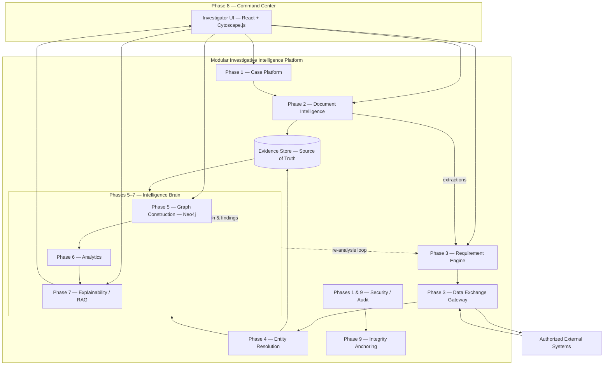
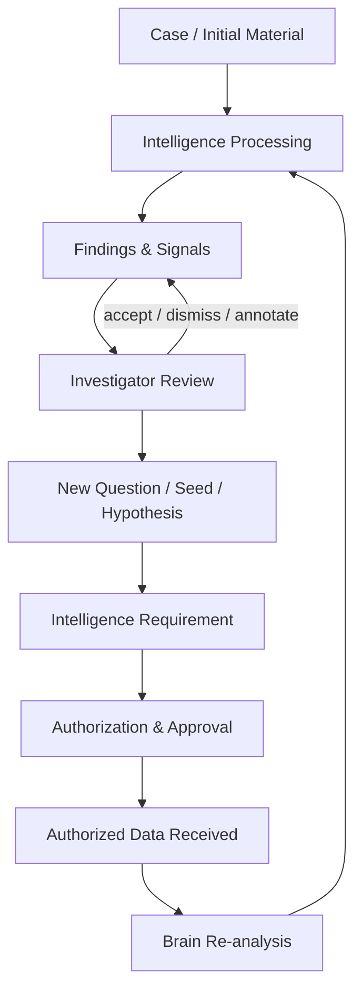
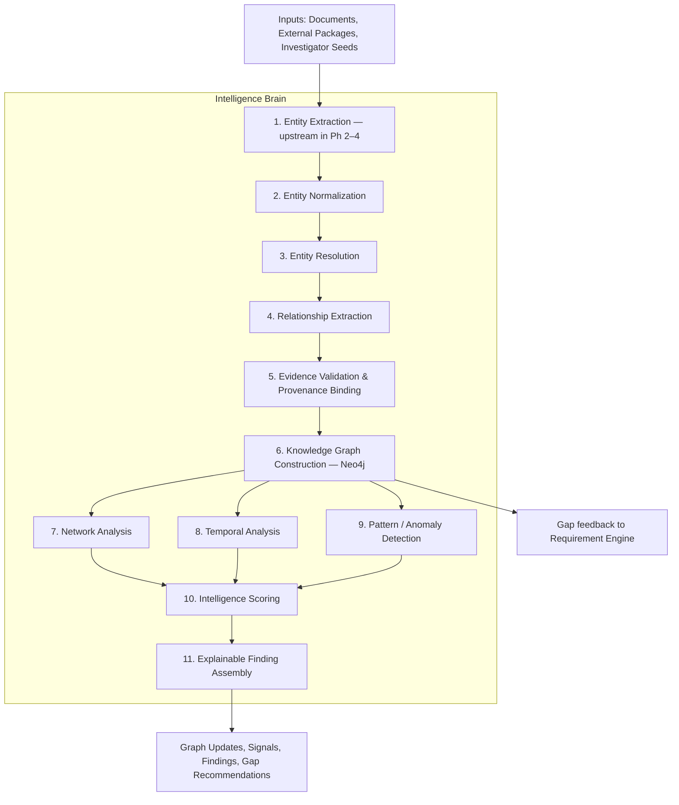

# System Architecture

**Project:** SIH 26189 – Criminal  
**Status:** FROZEN — Source of Truth  
**Last approved:** September 2026

---

## 1. Executive Summary

The system is a **case-centric investigative intelligence platform** with a central **Intelligence Brain** (Phases 5–7) that orchestrates understanding, correlation, analysis, and explainable output. External departmental systems remain **outside the trust boundary**; access is mediated through **scoped Intelligence Requests**.

**Deployment (MVP):** Modular monolith — logical components with clean boundaries, not separate microservices.

---

## 2. Architectural Style

| Decision | Choice | Rationale |
|---|---|---|
| Core organizing unit | **Investigation Case** | All intelligence scoped to an authorized investigation |
| Intelligence processing | **Pipeline + event-driven updates** | Incremental enrichment as new data arrives |
| Graph role | **Derived analytical reasoning structure** | Not visualization-only; drives correlation and analysis |
| Graph storage (MVP) | **Neo4j** | Derived case-scoped graph; rebuildable from evidence |
| LLM role | **Extraction, gap reasoning, explanation assistant** | Never the source of truth |
| External data access | **Request-mediated, scoped, auditable** | No unrestricted departmental access |
| Evidence model | **Provenance-first, immutable source records** | Investigative trust and defensibility |
| Blockchain role | **Integrity anchoring only** | Tamper-evident audit; raw data stays off-chain |

---

## 3. Source of Truth Hierarchy

```
Authoritative (Source of Truth)
└── Evidence Store
    ├── Uploaded documents (FIR, reports, scans)
    ├── External data packages (authorized responses)
    └── Audit & provenance metadata

Derived (Analytical — NOT source of truth)
├── Extractions & mentions
├── Resolved entity representations
├── Knowledge Graph (Neo4j — case intelligence view)
├── Analytics outputs (scores, paths, communities)
└── Findings (curated intelligence — always cite evidence)
```

**Rule:** On conflict, **evidence wins**. The graph is rebuilt/revised from evidence — never the reverse.

---

## 4. Nine Connected Phases

Phases form **one connected system**, not separate applications. **Build order = Phase 1 → 9.**

| Phase | Capability | Brain involvement |
|---|---|---|
| **1** | Foundation & secure case system | None |
| **2** | FIR & document intelligence | Extraction → mentions + provenance only |
| **3** | Intelligence requirements & data exchange | Gap analysis on case context; no graph reasoning |
| **4** | Integration & entity resolution | Normalization/resolution when external data arrives |
| **5** | Intelligence Brain & knowledge graph | **Full Brain begins** — derived graph construction |
| **6** | Network, temporal & pattern intelligence | Brain analytics stages |
| **7** | Explainable intelligence & investigative RAG | Brain output + evidence-grounded Q&A |
| **8** | Investigator command center | Unified UI over all prior phases |
| **9** | Blockchain, security & integrity layer | Cross-cutting; integrity anchoring formalized |

Phases 2–3 perform **minimal scoped processing** only. Full Intelligence Brain orchestration begins at Phase 5.

---

## 5. Major Logical Components

| Component | Responsibility | Phase |
|---|---|---|
| **Foundation & Case Platform** | Cases, users, roles, permissions, investigation lifecycle | 1 |
| **Document Intelligence Service** | Ingest FIRs/docs; extract entities/events with provenance | 2 |
| **Intelligence Requirement Engine** | Gap analysis; formulate scoped requests | 3 |
| **Data Exchange Gateway** | Boundary to authorized external systems | 3 |
| **Integration & Entity Resolution** | Normalize; resolve duplicates with confidence | 4 |
| **Intelligence Brain** | Orchestrates intelligence pipeline (Phases 5–7) | 5–7 |
| **Knowledge Graph Engine** | Derived entities, relationships, events in Neo4j | 5 |
| **Network / Temporal / Pattern Analytics** | Graph algorithms, timelines, anomaly detection | 6 |
| **Explainability & Investigative RAG** | Evidence-grounded Q&A, finding explanations | 7 |
| **Investigator Command Center** | Unified investigator UI (React + Cytoscape.js) | 8 |
| **Security, Audit & Governance** | AuthN/AuthZ, access policies, audit logging | 1, 9 |
| **Integrity Layer** | Hash anchoring, tamper detection, verification | 9 |
| **Evidence Store** | Source of truth for all source records | Cross-cutting |

### Component Boundaries (What Each Does NOT Do)

| Component | Does NOT |
|---|---|
| Document Intelligence | Resolve identities across sources; declare findings |
| Intelligence Requirement Engine | Fetch data directly from external systems |
| Data Exchange Gateway | Perform investigative reasoning or entity merging |
| Entity Resolution | Invent relationships without evidence |
| Knowledge Graph Engine | Replace evidence store; store authoritative truth |
| Analytics | Label entities as criminals; auto-conclude guilt |
| Explainability RAG | Generate facts without retrieval from evidence |
| Blockchain Layer | Store raw FIR/CDR/financial/location data |
| Command Center | Contain core intelligence logic |

---

## 6. System Architecture Diagram



---

## 7. Iterative Investigation Loop

Investigation is **cyclical**, not one-shot linear. This feedback loop is fundamental.



Each loop updates **Case Intelligence State** incrementally.

---

## 8. End-to-End Data & Intelligence Flow

| Step | What Happens | Key Outputs |
|---|---|---|
| 1. Case creation | Investigator opens/creates case | Case record, access policy |
| 2. Initial intelligence | FIR PDF/text or seed entity uploaded | Case context seed; document hash |
| 3. Document intelligence | Extract entities, events, identifiers | Mentions + confidence + provenance |
| 4. Initial understanding | Provisional entities from FIR | Draft investigative picture (`SOURCE_EXTRACTED`) |
| 5. Gap identification | Compare case needs vs known facts | Intelligence Requirements |
| 6. Request formulation | WHO/WHAT/WHY/CASE/PERIOD/SOURCE | Formal request objects |
| 7. Authorized exchange | Gateway submits; receives scoped payload | External data packages (immutable) |
| 8. Integration | Normalize; resolve same-entity? | Unified entity candidates |
| 9. Relationship extraction | Derive edges from CDR, finance, co-occurrence | Typed relationships with evidence |
| 10. Graph reasoning | Build/update derived Neo4j graph | Connected investigative network |
| 11. Analytics | Centrality, communities, timelines, anomalies | Investigative signals (not verdicts) |
| 12. Explainability | NL queries from graph + evidence | Grounded responses with citations |
| 13. Command center | Investigator explores, requests, annotates | Human decisions; audited actions |

### Case Intelligence State

```
Case Intelligence State
├── Known Facts          (from authoritative source records)
├── Extracted Mentions   (from documents, pending resolution)
├── Resolved Entities    (unified investigative entities)
├── Relationships        (evidence-backed edges — derived in Neo4j)
├── Events & Timeline    (ordered occurrences)
├── Intelligence Requests (pending / approved / fulfilled / rejected)
├── External Data Packages (immutable received payloads)
├── Signals & Patterns   (analytical outputs, not facts)
├── Findings             (curated, explainable intelligence)
└── Open Gaps            (missing intelligence still needed)
```

---

## 9. Intelligence Brain Architecture (Phases 5–7)

The **Intelligence Brain** is an orchestration layer plus specialized processing stages. It is neither Neo4j nor an LLM by itself.

### Pipeline Stages



### Brain Operating Modes

| Mode | Trigger |
|---|---|
| **Initial understanding** | New case / first document |
| **Incremental enrichment** | New external package received |
| **Re-analysis** | Investigator adds seed or changes scope |
| **Query-time reasoning** | Investigator asks question |

### Brain Explicitly Avoids

- Creating entities/relationships without evidence reference
- Auto-merging identities at low confidence without human review
- Producing conclusions beyond supported inference
- Treating unverified extraction as authoritative fact without labeling

---

## 10. Conceptual Data Model

### Core Domain Entities

| Concept | Description |
|---|---|
| **Case** | Authorized investigation container |
| **Document** | FIR, report, scan, attachment (hash, provenance) |
| **Extraction** | Output of document intelligence pass |
| **Mention** | Raw extracted reference before resolution |
| **Investigative Entity** | Unified real-world entity (Person, Phone, Vehicle, Account, Location, Org, CaseRef) |
| **Entity Alias** | Variant representation linked to entity |
| **Relationship** | Typed connection with evidence, confidence, time bounds |
| **Event** | Time-bound occurrence for timeline |
| **Intelligence Request** | Scoped authorization to seek external data |
| **Data Source** | Authorized external system |
| **External Data Package** | Immutable received payload |
| **Evidence** | Atomic support for a claim — **source of truth unit** |
| **Finding** | Curated intelligence (FACT / INFERENCE / SIGNAL) |
| **Provenance Record** | Origin and lineage metadata |
| **Audit Event** | Security/accountability log |
| **Integrity Anchor** | Hash anchor reference (local ledger MVP) |

### Relationship Types (Extensible)

| Category | Examples |
|---|---|
| Communication | CALLED, MESSAGED, CONTACTED |
| Financial | TRANSFERRED_TO, RECEIVED_FROM, ACCOUNT_LINKED |
| Physical / spatial | VISITED, SEEN_AT, RESIDES_AT |
| Associative | SEEN_WITH, ASSOCIATED_WITH, CONNECTED_TO |
| Ownership / control | OWNS, USES, REGISTERED_TO |
| Organizational | WORKS_FOR, MEMBER_OF, OPERATES |
| Investigative | INVOLVED_IN, MENTIONED_IN, LINKED_TO_CASE |

Every relationship carries: source system, evidence IDs, time validity, confidence, inference method.

---

## 11. Source & Data Exchange Model

### Trust Boundary

Our platform **never assumes** standing access to departmental databases. Every external datum enters through an **approved Intelligence Request** tied to case, purpose, and scope.

### Authorized Source Catalog

| Source | Typical Data | MVP |
|---|---|---|
| Police / FIR records | Case metadata, FIR text | Upload + mock adapter |
| CDR / telecom | Call/SMS metadata | Mock CDR adapter |
| Financial | Transactions, account links | Mock transaction feed |
| Criminal history | Prior cases | Mock history records |
| Vehicle (VAHAN-like) | Registration, ownership | Mock vehicle registry |
| Location / surveillance | Cell tower, CCTV events | Mock geo events |
| Social / OSINT | Public profiles | Curated mock + manual upload |
| Intelligence reports | Agency summaries | Mock report adapter |

### Intelligence Request Contract

| Field | Purpose |
|---|---|
| Case ID | Investigation scope |
| Subject Entity | WHO |
| Data Category | WHAT |
| Investigative Purpose | WHY |
| Time Period | FROM–TO |
| Target Source | WHICH authorized system |
| Requested By / Approved By | Accountability |
| Status | Draft → Pending → Approved → Submitted → Fulfilled / Rejected |

### Source Reliability Tiers

| Tier | Examples | Usage |
|---|---|---|
| **Tier 1 — Authoritative** | FIR system, court records | High-confidence fact |
| **Tier 2 — Operational** | CDR, financial intel | High confidence with scope |
| **Tier 3 — Derived / analytical** | Graph inference | Labeled as inference |
| **Tier 4 — Open / unverified** | OSINT | Never auto-merged as fact |

---

## 12. Security, Authorization & Audit

### Layers

Authentication → RBAC → Case-Level Authorization → Source-Level Authorization → Data Classification → Audit → Integrity Anchoring

### Roles

| Role | Capabilities |
|---|---|
| **Investigator** | Assigned cases, upload docs, request intelligence, view findings |
| **Senior Investigator / Supervisor** | Approve intelligence requests, view team cases |
| **Intelligence Liaison** | Manage external source submissions |
| **Auditor** | Read audit logs and provenance |
| **System Admin** | User/role management; no default case content access |

### Audit

Append-only audit log for: login, case access, document upload/view, request create/approve/submit, entity merge/split, finding acknowledge/dismiss, re-analysis trigger, integrity verify.

---

## 13. Blockchain / Integrity Architecture

### Off-Chain (Secure Platform Storage)

Raw FIR, CDR, financial, location records; full graph content; investigator notes; LLM prompts with PII.

### Anchored (Hash Only)

| Object | Purpose |
|---|---|
| Document | Tamper detection |
| External data package | Prove data unchanged since receipt |
| Intelligence request | Non-repudiation of authorization scope |
| Audit event batch | Immutable accountability |
| Graph snapshot (optional) | Detect unauthorized tampering |
| Finding publication | Integrity of intelligence product |

**MVP:** Local integrity/hash ledger with verification API. Blockchain boundary extensible for production.

---

## 14. Explainability Architecture

### Finding Taxonomy

| Type | Meaning |
|---|---|
| **Known Fact** | Directly stated in authoritative source |
| **Inferred Relationship** | Derived from multiple records with reasoning |
| **Anomaly / Signal** | Pattern deviating from baseline; investigative lead |
| **Confidence** | Numeric/ordinal certainty |
| **Investigator Interpretation** | Human-authored note; never auto-generated as fact |

### RAG Rules

1. Retrieve first; generate second
2. Every claim maps to citation or is labeled as hypothesis
3. If evidence insufficient → state explicitly; do not hallucinate
4. Graph paths shown alongside narrative
5. LLM is not the source of truth; evidence is

---

## 15. Investigator Experience (Command Center)

Interconnected views — selecting an entity in any view updates context everywhere:

**Case → Entities → Network → Timeline → Patterns → Intelligence Requests → Evidence → Findings → Audit & Integrity**

Language: "high network relevance", "potential connection", "requires investigation" — never guilt labels.

---

## 16. MVP vs Future Extensibility

### MVP Must Deliver

Full iterative loop with Operation Crosslink demo case; PDF/text FIR ingestion; mock source adapters; derived Neo4j graph; basic analytics; evidence-grounded findings and RAG; auth/RBAC/audit; local hash ledger.

### Extensible Later

Real CCTNS/ICJS/CDR integrations; advanced ML resolution; Govt SSO; production blockchain; Hindi/scanned document OCR; streaming feeds; multi-department tenancy.

### Extensibility Mechanisms

- Source Adapter Interface
- Brain pipeline stage interfaces
- Relationship type registry
- Reliability tier policy
- Case Intelligence State versioning
- Document intelligence provider abstraction (OCR/LLM)

---

## 17. Risk Guards

| Risk | Guard |
|---|---|
| LLM hallucination | Retrieval-grounded RAG; typed outputs; evidence required |
| Unauthorized data access | Request-mediated gateway; source-level ABAC |
| Silent entity merge errors | Confidence thresholds + human review queue |
| Graph as visualization-only | Analytics and RAG query graph; edges require evidence |
| Blockchain gimmick | Hash-only anchoring with verification UX |
| Disconnected modules | Shared Case Intelligence State + domain events |
| Guilt inference | Scoring = relevance/influence only |
| Architecture drift | This document is source of truth |

---

## Change Control

Modifications to this document require explicit architectural review. See [ARCHITECTURE-DECISIONS.md](./ARCHITECTURE-DECISIONS.md) for decision log.
